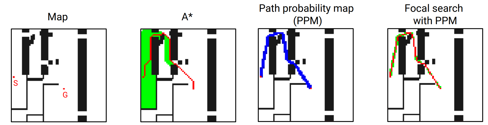

# TransPath: Learning Heuristics For Grid-Based Pathfinding via Transformers
[This](https://github.com/AIRI-Institute/TransPath) is the code repository for the following paper accepted at AAAI 2023: 

Daniil Kirilenko, Anton Andreychuk, Aleksandr Panov, Konstantin Yakovlev, "TransPath: Learning Heuristics For Grid-Based Pathfinding via Transformers", AAAI, 2023.

## Data
### Grids
Train, validation, and test maps with pre-computed values mentioned in our paper are available [here](https://disk.yandex.ru/d/xLeW_jrUpTVnCA). One can download and exctract it manually or just run `download.py`.

### DEM
DEM data with paired imagery used in our work are available [here](https://disk.yandex.ru/d/LIMbKd4AZPEUdA). Use `get_dem_focals.py` to generate gt-focal values. 

## Pretrained models
Directory `./weights` contains parameters for some of the pre-trained models from the paper.

Use `train.py` to train a model from scratch. Argument `--mode` defines the type of the model: `cf` and `f` are the models for grid-based pathfinding that predict correction factor and focal values respectively, `dem` is the model for DEM data.

Use `eval.py` and `eval_dem.py` to evaluate a model on the test set.

## Examples
Check `example.ipynb` for some examples of predictions and search results of our models. There are a few examples of train and out-of-distribution maps in the directory `./maps`.
